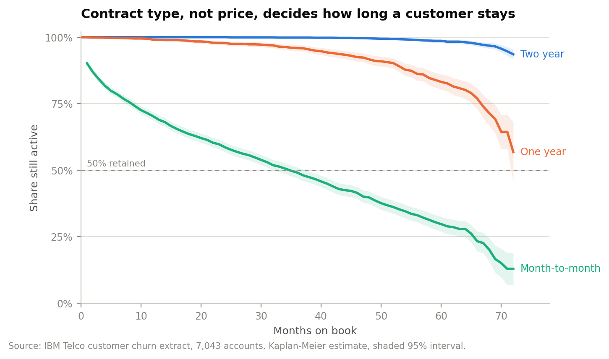
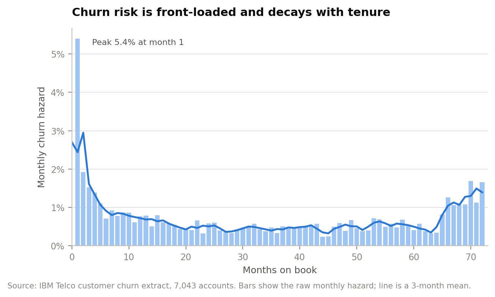
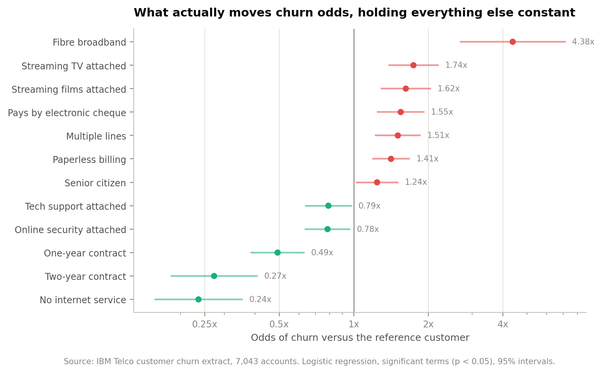
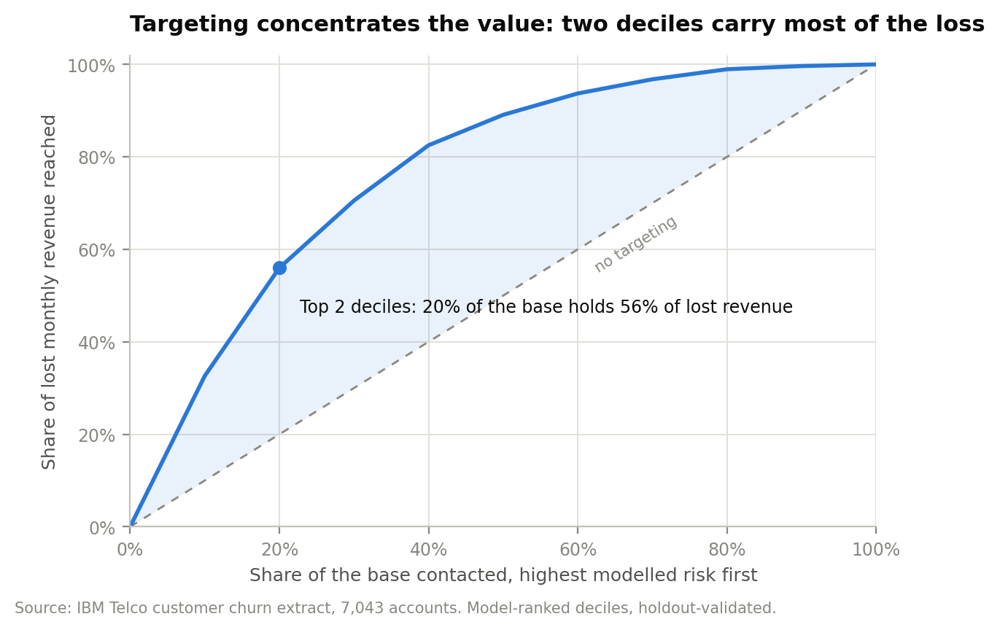
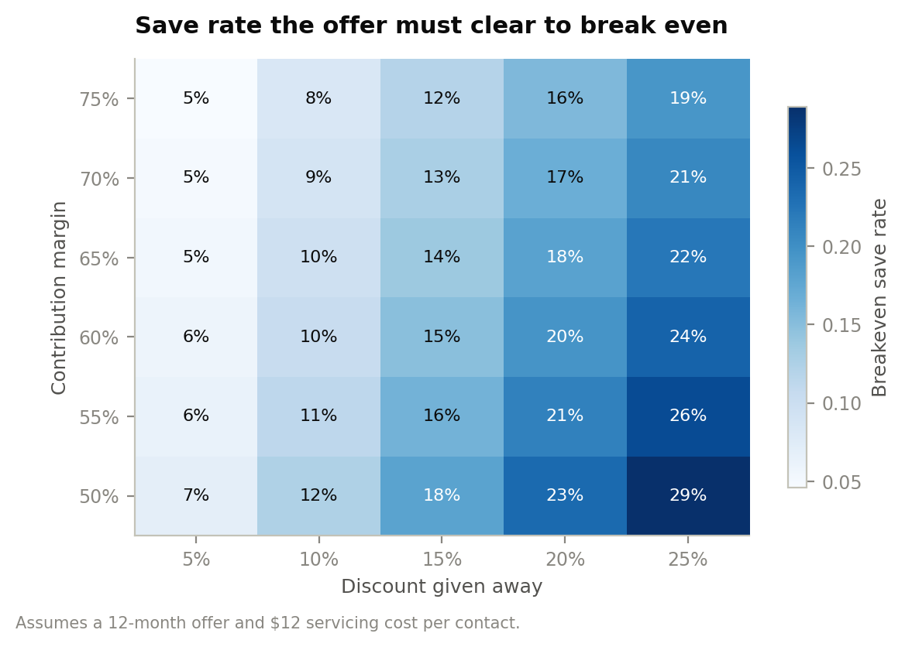

# Customer churn and retention economics

An analysis of a 7,043-account telecom book: what churn is costing, which accounts
carry the loss, and what a retention programme has to achieve before it pays for
itself.

The short version: **churn takes 26.5% of accounts but 30.5% of revenue**, because
the customers who leave are the ones paying the most. Two risk deciles hold 56% of
the loss. And the discount level on the save offer turns out to matter more to the
return than how many people the programme contacts.

---

## Headline findings

| | |
|---|---|
| Monthly recurring revenue on the book | **$456,117** |
| Accounts lost in the observation month | **1,869** (26.5%) |
| Recurring revenue lost | **$139,131/month — $1.67M annualised** |
| Share of the revenue book lost | **30.5%** |
| Average bill: leaver vs stayer | **$74.44 vs $61.27** (+21.5%) |
| Loss concentrated in one segment | **72%** sits in month-to-month fibre |
| Model discrimination (holdout) | **AUC 0.836** |
| Top two risk deciles | **20% of the base, 56% of lost revenue** |
| Recommended programme | **$120,210 net value, 1.77x return** |

## The four things that came out of it

**1. Contract type decides tenure; price barely moves it.**
Month-to-month accounts churn at 42.7% against 11.3% on one-year and 2.8% on
two-year terms. Median tenure on month-to-month is 35 months; neither annual
contract reaches 50% attrition inside the 72-month window. The gap is not noise —
log-rank χ² = 2,353 across the three curves (p < 0.001). Once contract type is
held constant, each extra dollar on the monthly bill is associated with slightly
*lower* churn odds (0.98x), which is the opposite of the intuition the commercial
team usually starts from.



**2. Risk is front-loaded and never fully goes away.**
The monthly churn hazard peaks at 5.4% in month one and averages 1.7% across the
first six months, against 0.6% beyond month 36 — roughly a threefold difference.
Onboarding is where the cheapest retention is available, but the curve flattens
rather than falling to zero, so a pure onboarding fix leaves most of the annual
loss untouched.



**3. Fibre is the problem product, not the premium product.**
Holding contract, tenure, bill size and every attached service constant, a fibre
line carries **4.38x** the churn odds of the reference customer (95% CI 2.68–7.17).
This is the largest single effect in the model by a wide margin. Month-to-month
fibre is 30% of the base and **72% of all lost revenue** — $100,482 a month from
one segment. Attached support products pull the other way: online security (0.78x)
and tech support (0.79x) both reduce churn odds significantly, which makes
attachment a retention lever rather than just an ARPU lever.



**4. Targeting works, but the offer size is what decides the return.**
The scoring model reaches AUC 0.836 on a 30% holdout. Its top decile churns at
76.6% — 2.89x the base rate — and the top two deciles capture 56% of lost revenue
from 20% of the base.

That precision is what makes an intervention viable, because the offer cost is
paid on everyone contacted while the benefit only accrues to the people who would
otherwise have left. In the top two deciles, 457 of 1,409 contacts are customers
who were never going to leave. Running the numbers across targeting depth and
discount level:

| Deciles | Offer | Contacts | Precision | Cost | Benefit | Net | Return |
|---|---|---|---|---|---|---|---|
| 1 | 10% | 705 | 77% | $79,810 | $161,073 | **$81,263** | 2.02x |
| 2 | 10% | 1,409 | 68% | $155,222 | $275,432 | **$120,210** | 1.77x |
| 2 | 15% | 1,409 | 68% | $224,379 | $275,432 | $51,053 | 1.23x |
| 3 | 10% | 2,113 | 59% | $224,099 | $344,300 | $120,200 | 1.54x |
| 2 | 20% | 1,409 | 68% | $293,537 | $275,432 | **–$18,104** | 0.94x |

A 20% discount destroys value at any depth past the first decile. Moving from a
15% to a 10% offer on the same audience more than doubles net value. The
programme breaks even at a **9.5% save rate** on a 10% offer, against 13.8% on a
15% offer — and published win-back rates for contract-conversion offers sit
comfortably above both.



## Recommendation

Contact the top two modelled risk deciles — 1,409 accounts — with a 10% bill
reduction held for twelve months in exchange for moving off month-to-month.
On a 25% save rate that returns **$120,210 of net contribution against $155,222 of
spend (1.77x)**, and it stays positive down to a 9.5% save rate. Give the offer to
the top decile only if budget is constrained: the return is higher (2.02x) on
roughly half the value.

Do not extend the discount past 10% to buy a higher acceptance rate. The
sensitivity grid shows the breakeven save rate rising roughly linearly with the
discount while the addressable saves do not, so the trade is loss-making before
it reaches 20%.



## What the analysis assumes

The extract carries revenue but no cost lines, so two numbers had to be supplied
from outside the data: a 65% contribution margin on recurring service revenue and
a 10% annual cost of capital. Both are swept across a grid in
`outputs/tables/breakeven_sensitivity.csv` — the recommendation holds anywhere
above a 50% margin.

The extract is also a single snapshot rather than a tracked cohort. Tenure is read
as time on book, leavers as events at t = tenure and retained accounts as
right-censored at t = tenure. That is the standard reading, and it is the
conservative one: treating the snapshot as a cohort would overstate early-life
churn. The full argument is in [`reports/technical-appendix.md`](reports/technical-appendix.md).

Save rates are modelled, not observed. The extract has no campaign history, so the
25% figure is an input to the case, not a finding — which is exactly why the
breakeven rate is the number the recommendation is anchored on.

## Running it

```bash
make data      # fetch the source extract
make install
make analysis  # writes outputs/metrics.json, tables and figures
```

Every figure quoted above is written by `src/run_analysis.py` into
`outputs/metrics.json`. Nothing in this README is typed by hand.

## Repository layout

```
data/raw/            source extract (fetched, not committed)
data/processed/      cleaned analysis frame
sql/                 staging model and the metric definitions
src/                 ingest, features, survival, drivers, economics, figures
outputs/             metrics.json, tables, figures
reports/             executive summary and technical appendix
dashboard/           Tableau build guide and flat extracts
```

## Data

IBM Telco customer churn extract — 7,043 accounts, 21 fields, one row per
customer. Published by IBM as a sample dataset and widely used as a churn
benchmark. Fetched by `make data` from the
[IBM repository](https://github.com/IBM/telco-customer-churn-on-icp4d).

Eleven accounts carry a blank `TotalCharges`. All eleven are tenure-zero
connections billed in arrears, so the value is set to zero rather than imputed or
dropped; the check is asserted in `src/ingest.py` and logged to
`outputs/metrics.json`.

## Reading order

1. [`reports/executive-summary.md`](reports/executive-summary.md) — two pages, the decision
2. This README — findings and evidence
3. [`reports/technical-appendix.md`](reports/technical-appendix.md) — method, assumptions, limitations
4. [`dashboard/README.md`](dashboard/README.md) — the Tableau build

---

Lohan De Silva · [github.com/Lohandesilva](https://github.com/Lohandesilva) · MIT licensed
